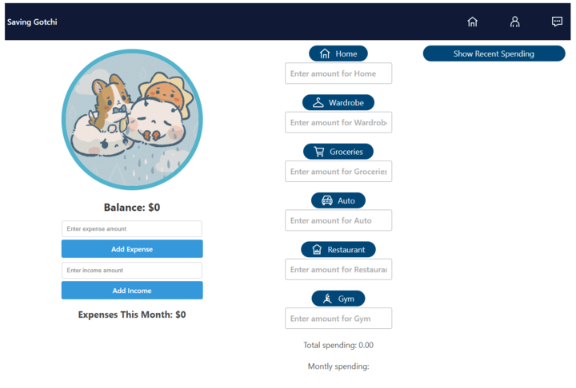

# Smart Wallet
Welcome to the Smart Wallet repository! The four of us have been hard at work with this final group project for our Front-End Web Development bootcamp. This README will walk you through everything you need to know about our project. Feel free to try it out with the live link!

## Features
Smart Wallet is a web application that helps users budget their expenses in a fun, intuitive way. By turning tracking your spending habits into a tomagachi-like game combined with a user friendly UI, we have turned money management into a simple game where the user's balance keeps the pet healthy and happy.

The application tracks the user's expenses, allowing them to input any income they have coming in or add any money they may spend be it on bills, groceries, clothing, take out, entertainment, etc. It stores the user's inputs to showcases their most recent list of purchases, adding these purchases up in the categories section to showcase what the money is spent on in a graph. As the months goes by, the user can see the history of their spending/balance, allowing them to view their habits in the long-term across several months.

## Live
put link here

## Screenshot

## Contributors
* [Dagmara Abramowicz](https://github.com/dagaab)
* [George Okorie](https://github.com/GiorgioDaVinci)
* [Gheorghe Costinel Malaiasi](https://github.com/Costinel22)
* [Rajpreet Rehill](https://github.com/RajpreetKR)

## Acknowledgments
to be added...
